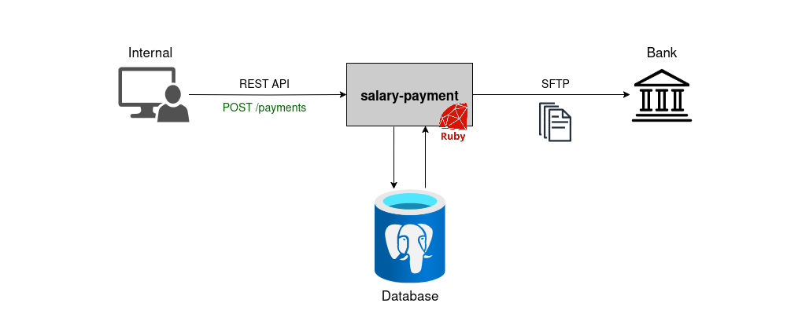

# Salary Payment



##### Table of Contents:

- [Project Structure](#project-struture)
- [Technologies](#technologies)
- [Setup](#setup)
- [Testing](#testing)
- [Running](#running)
- [Export Utility](#export-utility)
- [API Endpoint](#api-endpoint)

## Project Structure

```txt
.
├── app.rb
├── bin
│   ├── export
│   ├── run
│   └── test
├── config.ru
├── controllers
│   └── payments_controller.rb
├── docker-compose.yml
├── errors
│   └── validation_error.rb
├── Gemfile
├── Gemfile.lock
├── Rakefile
├── README.md
├── resource
│   └── schema.sql
├── salary-payment.drawio.png
├── services
│   └── payments_service.rb
├── spec
│   ├── payments_spec.rb
│   ├── spec_formatter.rb
│   └── spec_helper.rb
├── utils
│   ├── database.rb
│   ├── error_handler.rb
│   ├── http.rb
│   └── log.rb
└── validators
    └── payments_validator.rb

9 directories, 23 files
```

## Technologies

- Ruby (3+) - Programming language
- PostgreSQL - Database
- Docker - Containerization
- `WEBrick` - Web servers
- `rack` - HTTP request handling
- `rufus-scheduler` - Cronjob scheduling
- `bundle` - Dependencies management
- `rspec`/`rack-test` - Testing
- `logger` - Logging

## Setup

Execute this below command to initialize PostgreSQL database.
```bash
docker-compose up -d
```

## Testing

Execute below command to run all test cases
```bash
./bin/test
```

## Running

Execute below command to run the service on local machine
```bash
./bin/run
```

## Export Utility

#### 1. Export manually
```bash
./bin/export
```

#### 2. Daily export file at 5:00 PM
```ruby
# config.ru
scheduler = Rufus::Scheduler.new
scheduler.cron '0 17 * * *' do
  PaymentsService.export
end
```

## API Endpoint

This below is a sample request of API endpoint *POST /payments*:
```bash
curl --location 'http://localhost:9292/payments' \
--header 'Content-Type: application/json' \
--data '{
  "company_id": "com001",
  "payments": [
    {
      "employee_id": "emp001",
      "bank_bsb": "062000",
      "bank_account": "12345678",
      "amount_cents": 250000,
      "currency": "AUD",
      "pay_date": "2025-07-10"
    },
    {
      "employee_id": "emp002",
      "bank_bsb": "062000",
      "bank_account": "12345678",
      "amount_cents": 250000,
      "currency": "AUD",
      "pay_date": "2025-07-11"
    }
  ]
}'
```
